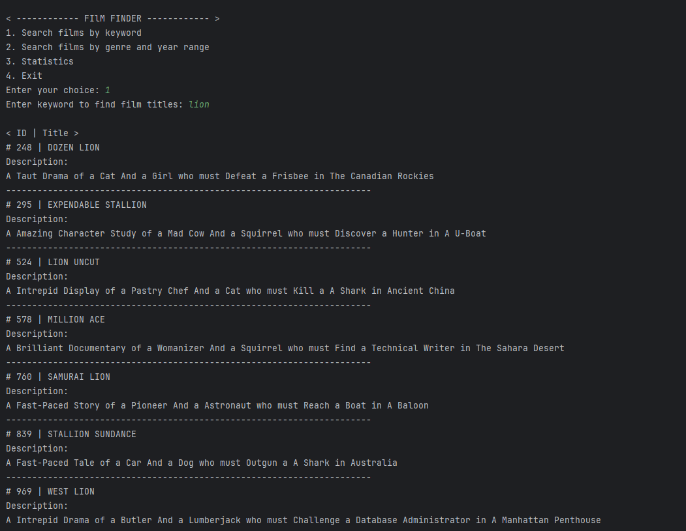
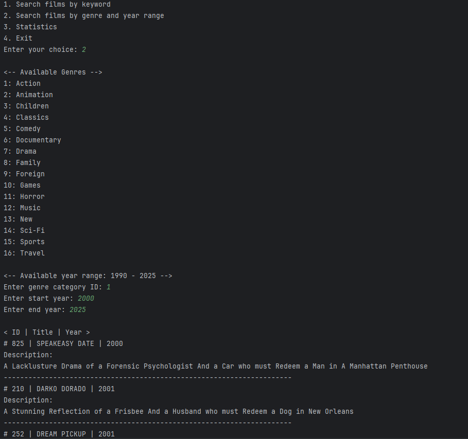
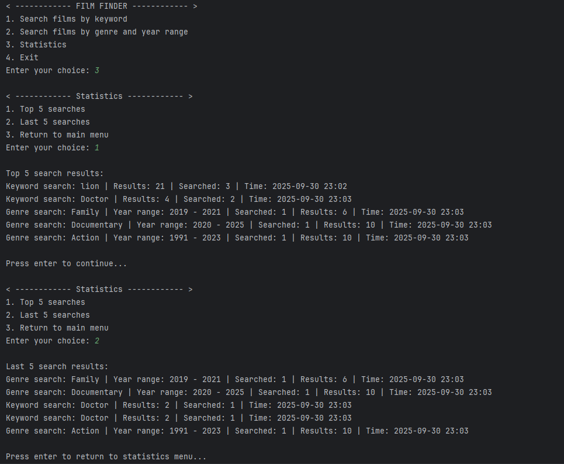

# Film Finder Project

**Description:**
Film Finder - is a console app for Python with which you can search films from MySQL database and log searches in MongoDB.
User can search films by either keyword or genre and year range, also check statistic of five last or popular searches.

## Functional
- `main.py` -  main part of script, responsible for menu and starting point
- `formatter.py` - contains `Formatter`, **class** responsible for film display, logging, and page look
- `mysql_connector.py` - contains `SQLConnector`, **class** responsible for connection to MySQL
- `mongo_connector.py` - contains `MongoConnector`, **class** responsible for connection to MongoDB
- `log_writer.py` - contains `LogWriter`, **class** responsible for logging into MongoDB
- `log_stats.py` - contains `LogStats`, **class** responsible for search statistic display and output

## Requirements
- [Python 3.10+](https://www.python.org/downloads/)
- [pip installer](https://pip.pypa.io/en/stable/installation/)

- **MySQL** with connection to database that have information about films
- **MongoDB** collection ready for saving logs
- #### You can use either local MySQL or MongoDB or a server, in which case you just need correct connection parameters in `.env`

## Installation
- ### 1. **Clone repository:**
- git clone <https://github.com/Ullairi/FilmFinder_PythonProject/tree/main>
- cd FilmFinder_PythonProject
- ### 2. **Activate venv(virtual environment)**
- python -m venv venv
- **For Windows**: venv\Scripts\activate
- **For Linux**: source venv\bin\activate
- ### 3. **Install requirements**
- pip install -r requirements.txt

## Startup
- ### 1. Make sure MySQL and MongoDB connected
- **Before `main.py` startup make sure to create `.env` file in root directory and fill it, for example:**
- # MySQL
- HOST=localhost
- USER=root
- PASSWORD=password
- DB_SQL=database name

- # MongoDB
- MONGO_URL=mongodb://localhost:27017/
- MONGO_DB=database
- MONGO_COLLECTION=collection
 
- ### 2. Start the program
- python app_location/main.py

## App Showcase

### Search by keyword

### Search by genre and year range

### Statistics

